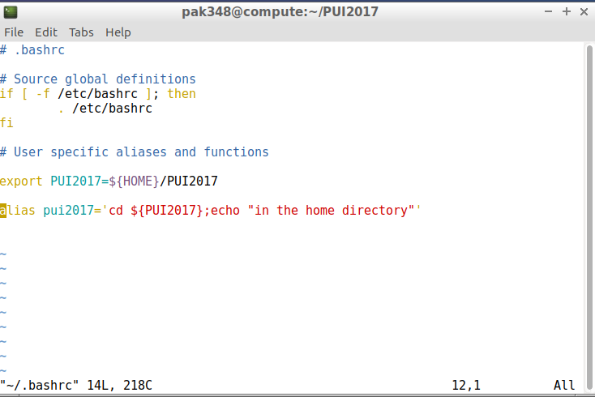
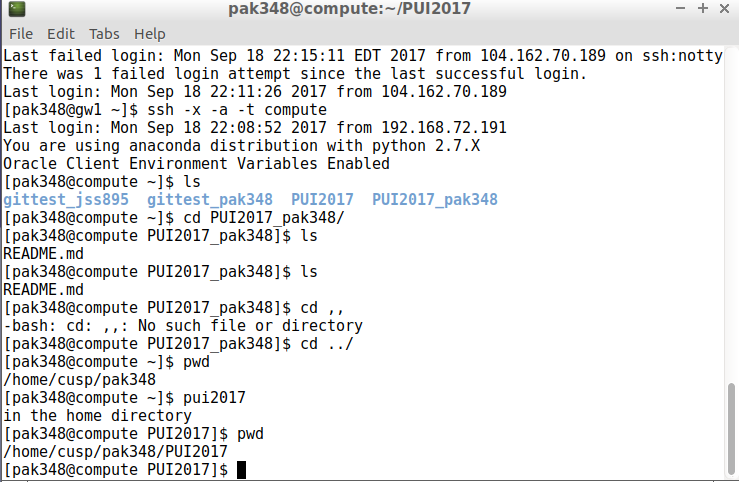

**Setting Up Environmental Variable & Alias**.

i. Open ~/.bashrc using an editor

ii. To create an Environmental Variable, Use Export Command followed by Environment variable assigned to the path

iii. To Create alias, Use Alias assigned to the desired function

iv. Save Bash File and source it

v. Use Echo $Variable to point to value in address

vi. Type pwd to see the source directory

vii. This is the Bashrc File

ix. This is the Screenshot of created Alias and Environmental variables creation

