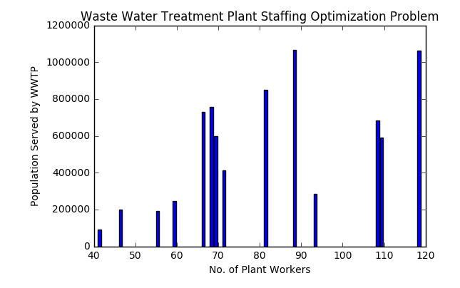

This Repoistory contains the work done for Homework Assignment -2 

Myself and Charlie worked together. However we had our own ideas and helped each other when we had doubts or clarification. Charlie showed  me that there is an Chrome extension to read JSOn files easier and I helped him write data to CSV Files.

This Homework Assignment contains Two Sections:

Section-1:

In this section we stream real-time bus data from MTA through the MTA Bus Time interface. 

In order to access the MTA data, an MTA AOI Key is required, that can be requested from MTA from the [MTA Developers Tools](http://bustime.mta.info/wiki/Developers/Index).

MTA uses  SIRI (Service Interface for Real Time Information) API to serve their data in both XML and JSON format. Here in this case we use the JSON format as it is increasing popularity in data access API over the web, and because it is a very natural format in Python, since it maps identically to a Python dictionary. 

Information on the vehicle monitoring stream is available [here](http://bustime.mta.info/wiki/Developers/SIRIVehicleMonitoring).

For example, using your key, you can retrieve all vehicle information for a bus line, e.g. B52, by accessing the following URL http://bustime.mta.info/api/siri/vehicle-monitoring.json?key=YOUR_KEY&VehicleMonitoringDetailLevel=calls&LineRef=B52 after replacing YOUR_KEY in the URL string with your own API key.

It is also to be noted that the BusTime API server strictly enforces users to issue only 1 request per 30 seconds. Please do not constantly download or fetch data from the API in
shorter periods.

is focussed on obtaining data from MTA pertaining to the Bus Schedules and real time monitoringis further is subdivided into two different Parts:

1. Tracking vehicle for each line

    This Program takes in the input of the MTA API Key and the Bus route number to provide the Number of Active Buses Plying and real time location coordinates (Lattitude & Longitude of the bus).
    
    On Executing the File python show_bus_locations_pak348.py <MTA_KEY> <BUS_LINE>
    
    The Program returns a value Similar to this:
    
      Bus Line : B52
        Number of Active Buses : 5
        Bus 0 is at latitude 40.687241 and longitude -73.941661
        Bus 1 is at latitude 40.690822 and longitude -73.920759
        Bus 2 is at latitude 40.688363 and longitude -73.979563
        Bus 3 is at latitude 40.688282 and longitude -73.979356
        Bus 4 is at latitude 40.686839 and longitude -73.964694
        
        
2. Tracking the Status of the Buses in Line

This program takes in the Input of MTA API Key, the Bus route number and the name of CSV file to write the details of next stop location and the current bus status.For example, whether the bus is approaching a stop, or is 1 stop away from it. It also handles exception (LookupError) wherein if the stop name and status is unknown it does not stop the loop rather returns"N/A" value.
    
    On Executing the File python get_bus_info.py <MTA_KEY> <BUS_LINE> <BUS_LINE>.csv
    
        The Program returns a value Similar to this:
        
            Latitude,Longitude,Stop Name,Stop Status
            40.755489,-73.987347,7 AV/W 41 ST,at stop
            40.775657,-73.982036,BROADWAY/W 69 ST,approaching
            40.808332,-73.944979,MALCOLM X BL/W 127 ST,approaching
            40.764998,-73.980416,N/A,N/A
            40.804702,-73.947620,MALCOLM X BL/W 122 ST,< 1 stop away
            40.776950,-73.981983,AMSTERDAM AV/W 72 ST,< 1 stop away
            40.737650,-73.996626,AV OF THE AMERICAS/W 18 ST,< 1 stop away
            
Section-2:

In this section we tried to experiment and learnt to use Pandas Library of Python.

We Chose a [dataset within the CUSP data facility (DF)](https://datahub.cusp.nyu.edu/data-catalog) that was available in CSV format. We chose one that had at least 2 numerical value columns.The data stored in the CDF was indexed to an environmental variabl "DFDATA" that points to the path: /gws/open/NYCOpenData/nycopendata/data/

1. For the first part we have chosen the Waste Water Treatment Plant dataset from Department of Environmental Protection, NYC. This was made for State Pollutant Discharge Elimination System. A Detailed Report of the same is available in this link [here](http://www.nyc.gov/html/dep/pdf/harbor/spdes_bmp_report_2012.pdf)

In this analysis we have tried to derive a correlation between The Staff Count at plant and the Population served. Find below the correlation between them. It can be noted that Hunts Point WWTP has higher staff for the population it serves.

