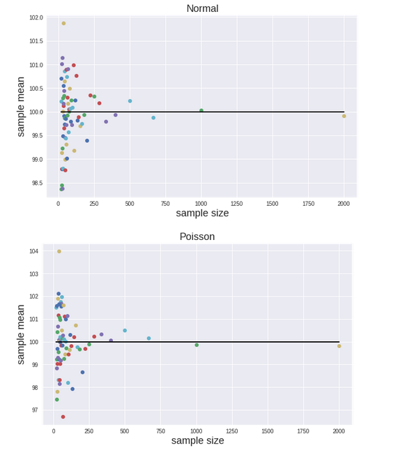
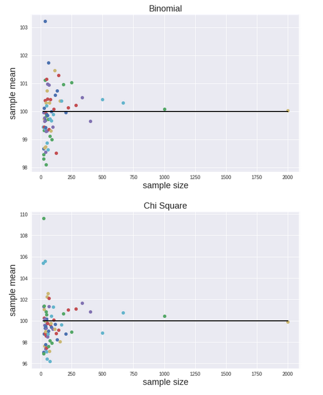
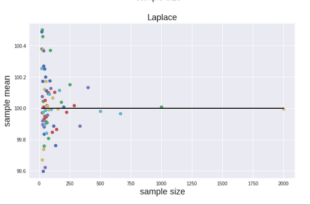
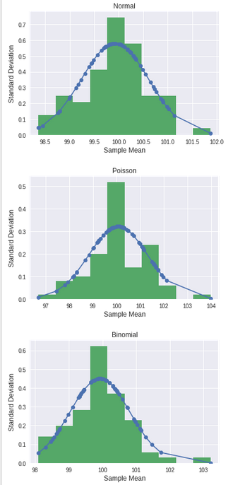
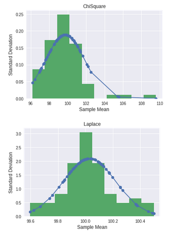
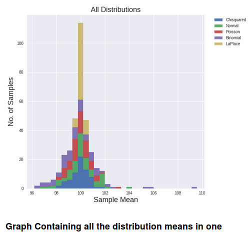
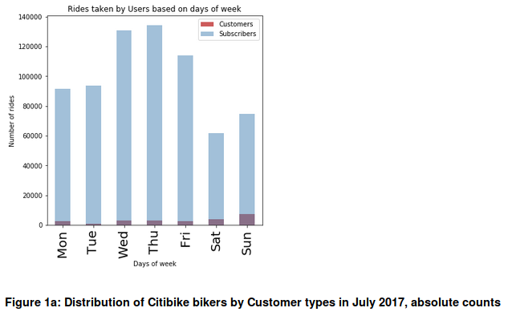
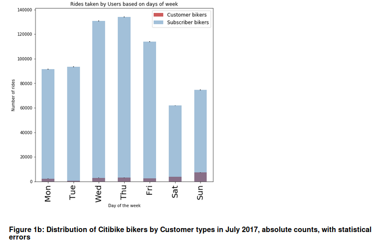
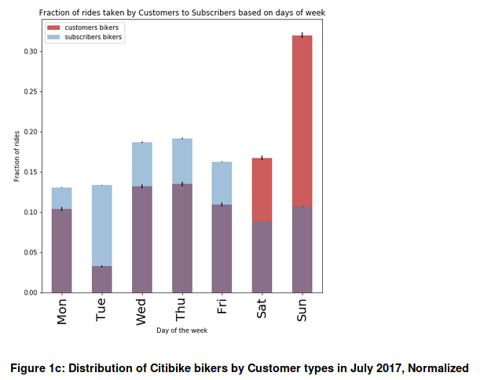

This Repository contains the work done for Homework Assignment - 3

I worked on my own for most of the Assignement. However I discussed with Charlie and Sarah for the Citibike Assignment. I helped Charlie to Understand parameters for Binomial Distributions and Sarah Helped me to add a blanket of Normal Curve over the Distributions.

This Homework Assignment contains Three Sections:

Section-1:

In this section we demonstrates visually in a data-driven way the Central Limit Theorem.

Generated 100 samples of different sizes N (N>10 & N<2000) from each of 5 different distributions (500 samples in total), all with the same population mean

A Normal, a Poisson, a Binomial, a Chi-Squared distribution, and a Laplace distribution were demonstrated.

For each sample plot the sample mean (dependent var.) against the sample size N (independent var.) were plotted.

A gaussian blanket was fit over the distribution of means.

*Distributions:*

*Histograms*

*All Distributions*

Section-2:

In this section we tried to work on the data-driven inference based on CitiBike data.

We Chose a dataset from Citibike data Library that is available [here] (https://s3.amazonaws.com/tripdata/index.html)

We wrote a program to Derive Correlation from Citibike Data.

Initially I tried to derive correlation between the Age and average trip duration for each age group. But I was not succesful on that effort so I went ahead and derived a correlation between the type of customer and Citibike Usage.

By observing the data I found out that during the weekdays Subscribers utilize more Citibike than the Customers and viz.

Problem Statement: Does Subscribers take more rides on weekdays than Customers?

Alternate Hypothesis: Subscribers take more rides on Citibikes more than Customers during Weekdays.

Null Hypothesis: Customers take the same or more number of rides than Subscribers during Weekdays.

Section-3:

Program to study how the new bus route for X8 is improving commute times?

Problem Statement: How is the new bus route for X8 improving commute times?

Alternate Hypothesis: The Average commute time for the new bus route X8 is lesser than the average commute time for the old commute route of X8.

Ha: newMean - oldMean < 0

Null Hypothesis: The Average Commute time for the new route is the same or longer than the old route.

H0: newMean - oldMean >= 0

Let us define the value of significance level α = 0.5 (5%)

So the Confidence Level would be 1-α = 95%

Z = \frac{\mu{pop} - \mu{sample}}{\sigma / \sqrt{N}}

z = (oldMean - newMean)/(oldStd/np.sqrt(len(data)))

If the value of p(Ha)-p(H0) > α

The Null Hypothesis can be rejected. In this case,

p(Ha)-p(H0) = 2.556397 - 2 (For 2 Std, Deviations Considered) = 0.556397

This value is greater than α

Therefore,

Since the value of Z>2 which is more than 2 Standard deviations above New Mean.

The Null Hypothesis Can be rejected

