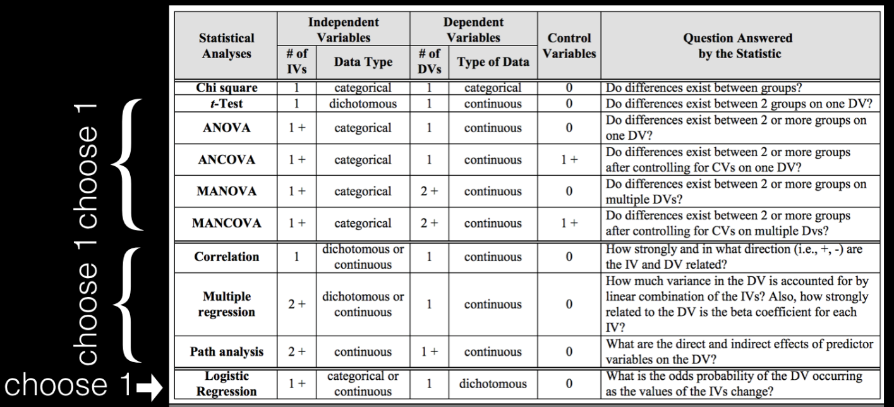

This Repository contains the work done for Homework Assignment - 3

I worked on my own for most of the Assignement. 

This Homework Assignment contains Three Sections:

Section-1: Review of Sarah's Citibike Assesment

Reviewed Sarah's Citibike Assesment on the following attriburtes:

a. verify that their Null and alternative hypotheses are formulated correctly

b. verify that the data supports the project: i.e. if the a data has the appropriate features (variables) to answer the question, and if the data was properly pre-processed to extract the needed values (there is some flexibility here since the test was not chosen yet)

c. chose an appropriate test to test H0 given the type of data, and the question asked. 

Section-2:

| **Statistical Analyses	|  IV(s)  |  IV type(s) |  DV(s)  |  DV type(s)  |  Control Var | Control Var type  | Question to be answered | _H0_ | alpha | link to paper **| 
|:----------:|:----------|:------------|:-------------|:-------------|:------------|:------------- |:------------------|:----:|:-------:|:-------|
Chi-Squared	| 1,  | Name & Religious Priming| 1, Rating of popular political figure| categorical | 1, Religion |Categorical) | Does Politically conservative participants primed with President Obama’s middle name rate him more negatively than would those who are not shown his middle name? | Middle Name Primed Rate Negatively >= Middle Name Not Shown | 0.05 | [The effects of name and religious priming on ratings of a well-known political figure, President Barack Obama]( http://journals.plos.org/plosone/article?id=10.1371/journal.pone.0180676) |
  |||||||||

| **Statistical Analyses	|  IV(s)  |  IV type(s) |  DV(s)  |  DV type(s)  |  Control Var | Control Var type  | Question to be answered | _H0_ | alpha | link to paper **| 
|:----------:|:----------|:------------|:-------------|:-------------|:------------|:------------- |:------------------|:----:|:-------:|:-------|
Correlation	| 1, electrophysiological Measurement| continuous | 1, behavioral Measurement | continuous | 2, Gender & Chronological Age | Dichotomous/Categorical | Is Behavioral auditory and language measurements and electrophysiological evaluations Correlated?  |Behaviorial Measurements depends on Electrophysical Measurement | 0.05 | [Cortical maturation in children with cochlear implants: Correlation between electrophysiological and behavioral measurement]( http://journals.plos.org/plosone/article?id=10.1371/journal.pone.0171177) |
  |||||||||

| **Statistical Analyses	|  IV(s)  |  IV type(s) |  DV(s)  |  DV type(s)  |  Control Var | Control Var type  | Question to be answered | _H0_ | alpha | link to paper **| 
|:----------:|:----------|:------------|:-------------|:-------------|:------------|:------------- |:------------------|:----:|:-------:|:-------|
Logistic Regression	| 1, Flow cytometry measurements| Continous | 1, Diagnosed Leukemia| categorical | - |- | Can Leukemia be predicted using Flow cytometry measurements | Test Scores ~= Mean Features| 0.05 | [Leukemia Prediction Using Sparse Logistic Regression]( http://journals.plos.org/plosone/article?id=10.1371/journal.pone.0072932) |
  |||||||||

Section-3: Analysis of the Hard to Employ program in NY

Reproduce the analysis of the Hard to Employ programs for NY. The relevant data for the study is detail described in the Chapter 2 of the original document(http://www.mdrc.org/sites/default/files/What Strategies Work for the Hard FR.pdf)

This analysis is focussed the following attributes 

1. Ever employed in a CEO transitional job
2. Convicted of a felony

Null Hypothesis : ******Convicted of a felony after 3 years

Both tests, Z and chi-sq, should be completed for the "Convicted of a felony after 3 years" data.
The result of the test in term the rejection of the Null should be stated in all cases (for both tests and both for the original "Ever employed in a CEO transitional job" data and the "Convicted of a felony after 3 years data").

*****

Section-4: Tests of correlation using the scipy package with citibike data.

Use the following are 3 tests to assess correlation between 2 samples of citibike data:
•	Pearson’s test
•	Spearman’s test
•	K-S test
There is a skeleton notebook that works on a similar question, age of male vs female riders. Follow it to see how to set up the assignment notebook citibikes_compare_distributions.ipynb.
Use: trip duration of bikers that ride during the day vs night. State your result in words in terms of the Null Hypothesis
Use: age of bikers for trips originating in Manhattan and in Brooklyn. Use at least 2 months of citibike data. The citibike data can be accessed from the citibike website - make sure you do it in a reproducible way, or in the CUSP data facility at the path /gws/open/Student/citibike

You must state the Null Hypothesis, according to what you know about the test and the scipy.stats package documentation for three scipy.stats function, corresponding to the three tests.
You must put the caluclated statistics and the p-value in the context of null hypothesis rejection in each case.

